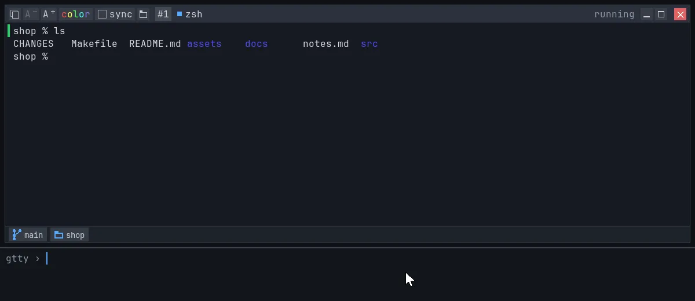
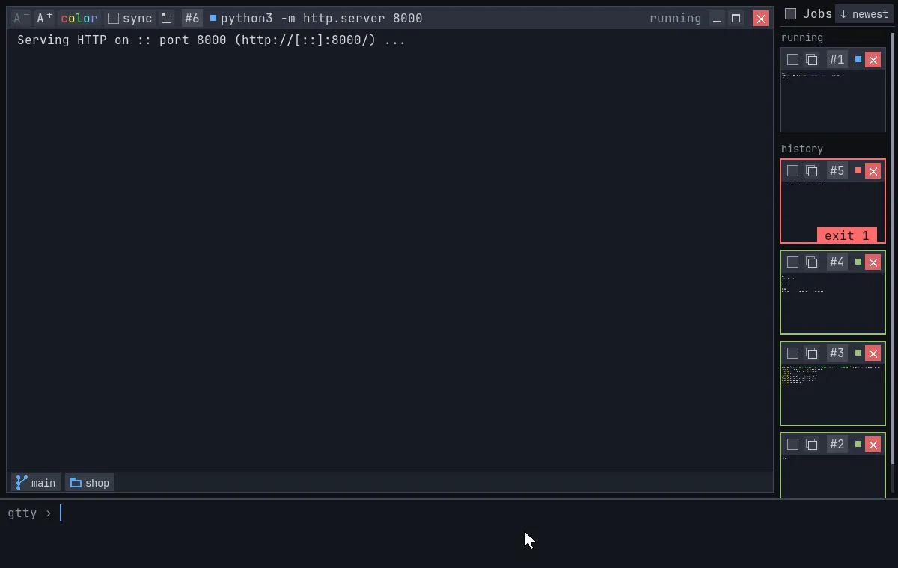
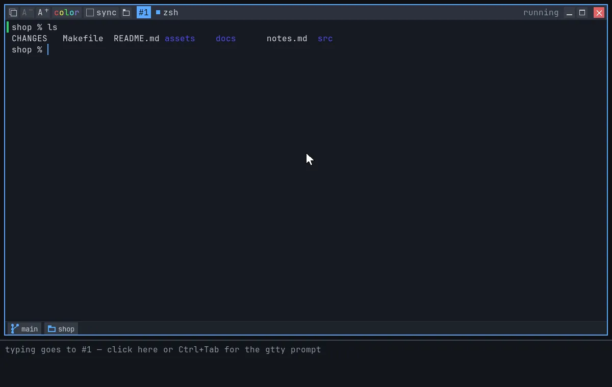
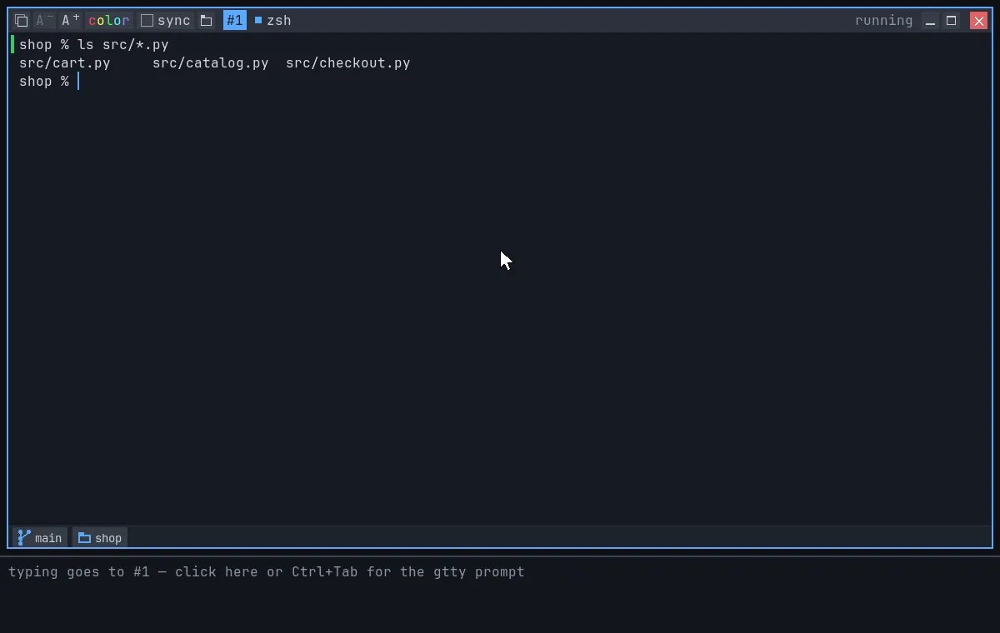
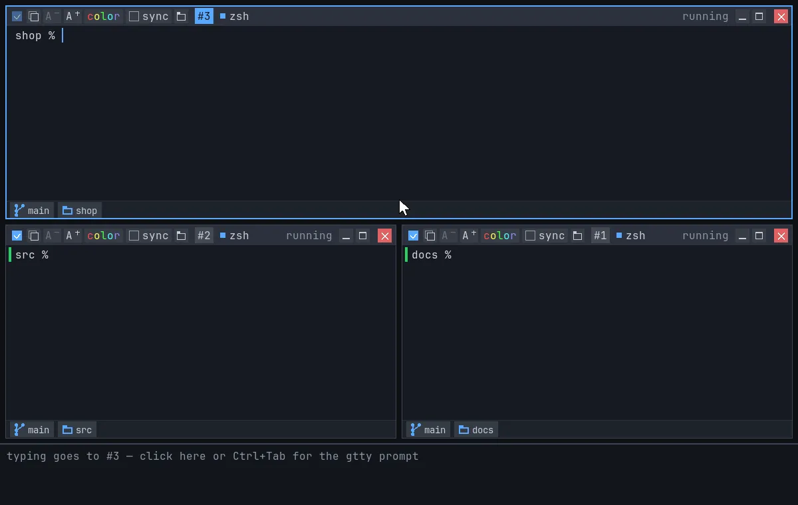
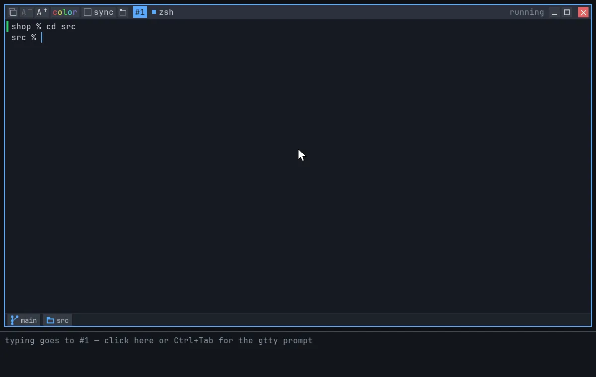

# gtty — a terminal where every command gets its own window

## Install

<!-- TODO: link the downloads once releases are published (codeberg.org/gttyterm/gtty, not created yet). -->

- **macOS** (Apple Silicon, 13+): download `gtty-<version>-macos.dmg` from
  the releases page *(TODO: link)* and drag gtty to Applications.
- **Linux** (x86_64): download `gtty-<version>-linux-x86_64.tar.gz` *(TODO:
  link)*, then `tar xzf gtty-*-linux-x86_64.tar.gz && sudo ./gtty-*/install.sh`
  (or `PREFIX=~/.local ./gtty-*/install.sh` for just you). `.deb` and
  `.rpm` packages are built too *(TODO: link)*.
- **Package managers:** *TODO* (no Homebrew tap or distro package yet).
- **From source:** see [HACKING.md](HACKING.md) (Zig 0.16 + SDL3).

## Features

### Every command in its own window

Each command opens its own job window: green when it worked, red with the
exit code when it didn't. Older windows wait in the job grid, and as many as
fit can sit side by side.

### Copy a command's output in one click

The copy button takes just the last command's output: no prompt, no
command line. Your last copies are under **Paste ▸** in the right-click
menu.

### Edit the command line like a text field

In zsh and bash, ⌥/Ctrl + arrows jump words, Shift selects, typing or
pasting replaces the selection, and Backspace deletes it.

### Files with the mouse

Hover a file name in the output and it gets an outline. Double-click opens
the file, or `cd`s into a folder. Hold and drag the file into another
app, or drop files on a window to copy them into its folder.

### Type into several terminals at once

Tick **sync** on one window and everything you type there is typed into
every other window on screen as well.

### Chips: git branch and folder

The footer chips show the window's git branch and folder. Hover the
branch to switch to another one, and click the folder to jump to any
folder above it.

### And also

- Readable colors on any theme: unreadable colors are lightened, and
  colors can be turned off per window.
- Emoji and wide characters (CJK) drawn in full; copy gives back exactly
  what was printed.
- Text reflows when you resize.
- Paste history and folder history (`cd` back) in the right-click menu.

More in the [user guide](docs/guide.md).

## What it doesn't do

- No account, no login, no telemetry.
- Your shell stays your shell: bash, zsh or fish, with your own config.
- Programs get a real terminal: ssh, git, build tools and REPLs work as
  usual. Full-screen programs (vim, htop, tmux) aren't fully supported
  yet.

## Source & license

Source and issues: codeberg.org/gttyterm/gtty *(TODO: the repository
doesn't exist yet)*.

Copyright 2026 Sagi Forbes Nagar. gtty is free software, licensed under the
GNU General Public License v3.0 or later — see [LICENSE](LICENSE).
Third-party components: [THIRD_PARTY.md](THIRD_PARTY.md). Contributing:
[CONTRIBUTING.md](CONTRIBUTING.md).

## About

gtty is designed and maintained by Sagi Forbes Nagar. The concept, UX and
architecture are my own; much of the code was written with AI assistance
(Claude) and reviewed, tested and shaped by me.
