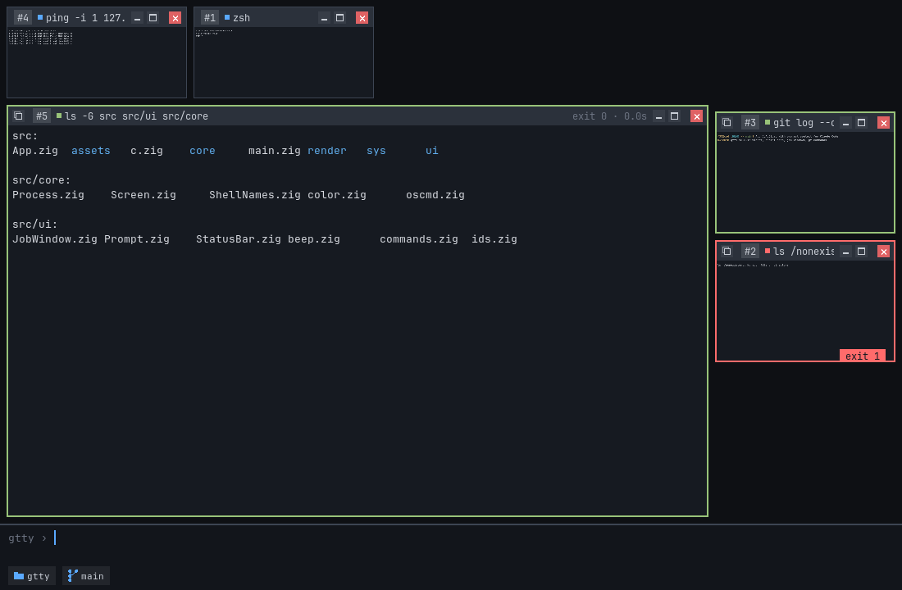
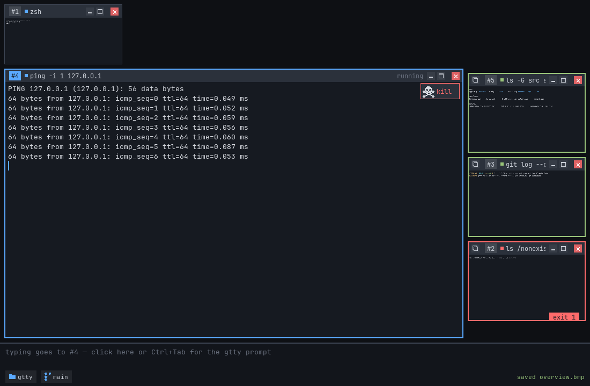

# gtty user guide



## Starting gtty

```sh
gtty
```

It opens in the folder you start it from (from the Dock or Finder: your home
folder), with your shell already running in a window.

| Option | |
|---|---|
| `gtty -c htop` | start with another command instead of your shell (`--command` too) |
| `gtty -c ""` | start with just the prompt |
| `gtty --help` | usage |
| `gtty --version` | version |
| `GTTY_FONT_SIZE=16 gtty` | bigger or smaller text |
| `GTTY_ANIM_MS=0 gtty` | no window transitions (default 220 ms) |
| `GTTY_MARKS=0 gtty` | no marks on the left edge of the windows |

## The screen

In the picture above:

- **The current window** — the command you're working with. It fills the
  middle of the screen and gets your keystrokes while it runs.
- **Job grid** (right side) — all your other windows, shown smaller: the
  ones still **running** on top (they keep updating), then the finished ones
  (**history**), the most recently used first in each group. Scroll with the
  wheel or the scroll bar on its right. The border shows how each one
  ended. Click one to bring it to the middle. It appears when
  there is something in it.
- **The prompt** (bottom) — where you type the next command.
- **Status bar** (very bottom) — short notices ("copied 12 lines").

## Chips: git branch and folder

The strip along the bottom of a window holds its **chips**. A window
whose program runs inside a git repository shows the **branch** first. It follows the folder the program is
in, so after `cd` in a shell it shows that folder's branch (and disappears
outside a repository).

- **Hover** the chip (or click it): a box with the full branch name, a
  **copy** button and an **expand** button (^).
- **Expand:** the local branches, the current one marked green. Type to
  filter, ↑/↓ to choose, **Enter** (or a click) switches to it (`git
  switch`, in that window's folder). The box turns green and closes; if
  git refuses (e.g. uncommitted changes in the way), it turns red and
  shows git's message. **Esc** closes it.
- Move the mouse away and it closes by itself after 5 seconds (the bar
  along its bottom counts down); a click anywhere else closes it at once.

Your shell's own prompt shows the new branch after your next Enter.

Next to it, the **folder chip** shows the name of the folder the window's
program is in (not in an ssh session).

- **Hover** it: the full path and a **copy** button.
- **Click** it: the folders above this one, `/` on top and the parent
  folder at the bottom, already chosen. Type to filter, ↑/↓ to choose,
  **Enter** (or a click) `cd`s the shell there. This works while the shell
  waits for your input; while a command runs, the box says the shell is
  busy.

Every window has a number (`#4`) so you can tell them apart. Click any window
in either grid to bring it into the middle; the one that was there moves to
a grid.

## Running commands

Type a command at the prompt and press **Enter**. It opens in a new window
in the middle, and whatever you type now goes to it.

```
bash          a window running bash
s             a window running your own shell
ls -l         ls in its own window
make          a build — start the next command while it runs
```

**When a command finishes**, its window border turns **green** (it
succeeded) or **red** (it failed, with the exit code at the bottom), and the
keyboard goes back to the prompt.

**To start another command while one is running**, click the prompt (or
press **Ctrl+Tab**). Type the next command: it takes the middle, and the one
that was there moves to the job grid on the right.

**Window buttons** — on the left of a window's title: **copy** its output
(see below), text size **A−** / **A+**, and **color** (the word
*color* in colored letters; struck through when off) to turn the program's colors off and on again. On the right:
**minimize** (send it to a grid), **maximize** (the whole gtty screen;
**F11** too), and the red **✕**. ✕ closes a finished window; on a running
shell it ends the shell as if you typed `exit` and moves it to the history
grid; on any other running command it first shows a small skull — click the
skull to kill the command.



**If your shell exits by itself** (`exit`, or it crashes), its window
moves to the job grid. If no other shell is still running, gtty opens a
new one. If shells keep exiting right away (more than 5 in 5 seconds,
e.g. a broken shell config), gtty stops opening them and beeps; type `s`
to open one yourself.

### Copying a command's output

The **copy** button in a window's title copies:

- **a finished window:** all of its output.
- **a running zsh or bash window:** only the **last command's output**
  (so far, if it still runs), without the prompt or the command line.
- **a program you type into** (an ssh session, `python`, …): the answer to
  the last line you typed, without the next prompt.
- **other shells:** everything.

### Marks on the left edge

A thin colored strip along the left of each window shows what every line
is: **green** for what you typed.
Output and prompt lines have no mark, so each command you typed stands
out at a glance.

Turn the marks off, change their width or their colors in **Settings →
General** (or start with `GTTY_MARKS=0`, `GTTY_MARK_WIDTH=6`,
`GTTY_MARK_INPUT=#00ff00`).

### Copy, paste and the right-click menu

- **⌘C** (Linux: **Ctrl+Shift+C**) copies the selected text; **⌘V**
  (Ctrl+Shift+V, Shift+Insert) pastes it into the window you're typing
  into, or into the prompt. Plain Ctrl+C and Ctrl+V go to the program, as
  in any terminal. One press always pastes once.
- **Right click** a window's text or the prompt: **Copy** and **Paste**.
- **Paste ▶** — click the arrow next to Paste for your **last 5 copies**
  in gtty (newest first, each copy listed once; line breaks shown as ⏎).
  Pick one to paste it.
- **History ▶** (in a shell window) — the last 10 folders your shell was
  in. Pick one to `cd` back there (while the shell waits for your input).

### gtty's own commands

| Type | To |
|---|---|
| `s` | open your shell in a window |
| `list` | list the windows |
| `focus 3` | bring window #3 to the middle |
| `close 3` / `close all` | close windows (a running shell exits to the job grid; if no shell is left running, a new one opens) |
| `zoom in` / `zoom out` / `zoom 150%` | zoom the current window |
| `colors` / `colors off` | turn the current window's colors off / on |
| `/clear` | clear the current window |
| `show notes.pdf` | open a file in its default app (no app for it: you pick one) |
| `show -a notes.pdf` | choose the app to open it with |
| `settings` | open the settings window (also in the gtty menu) |
| `quit` | exit gtty |
| `help` | show this list |

Anything else your shell knows — a program, a script, `cd`, `for …`, and
your own aliases and functions (`ll`) — runs in a window, just as in your
shell. If gtty and your shell share a name, your shell wins: plain `clear`
runs the system's `clear`. Start with `/` for gtty's (`/clear`).

A line that means nothing to either gets a beep and flashes red, so you can
fix it.

### Keys

| Key | |
|---|---|
| Ctrl+C / Ctrl+D / Ctrl+Z | to the running command, as in any terminal |
| Ctrl+Tab | next running window, then the prompt |
| ⌘C (Linux: Ctrl+Shift+C) | copy the selected text |
| ⌘V (Linux: Ctrl+Shift+V), Shift+Insert | paste into the window you're typing into, or the prompt |
| Right click | menu with **Copy**, **Paste ▶** (your last copies) and **History ▶** (earlier folders) |
| ⌘/Ctrl + = − 0 | zoom in / out / reset |
| Mouse wheel, PageUp / PageDown | scroll; over a grid, scroll the grid |
| ⌘T (Linux: Ctrl+Shift+T) | new shell, in the folder of the window you're working in |
| ⌘N (Linux: Ctrl+Shift+N) | new gtty window (another gtty), in that folder too |
| ⌘W | close the window you're typing into |
| F11 | maximize |
| Up / Down at the prompt | earlier commands |
| ⌥ ← / → (or Ctrl ← / →) in a shell | jump a word back / forward |
| ⌘ ← / →, Home / End in a shell | start / end of the line |
| Shift + any of those | mark the text the cursor passes over; ⌘C copies it, Backspace / Delete erase it, typing replaces it |

A paste into zsh, bash or vim arrives as one block (bracketed paste): a
pasted multi-line script lands in the input line instead of running line
by line.

Emoji, symbols and wide characters (Chinese, Japanese, Korean) are drawn
in full, two columns wide where the terminal expects it; copying gives
back exactly what the program printed.

Word jumps and marking work in zsh and bash windows (`s`) while the shell
waits for your input. On macOS, Ctrl ← / → switch desktops unless you
turn that off (System Settings → Keyboard → Keyboard Shortcuts → Mission
Control); ⌥ ← / → always works.

### Menus and settings

gtty's menus are in the menu bar at the top of the screen on macOS; on
Linux gtty shows a thin menu bar at the top of its window:

- **gtty** → **Settings…** (⌘, on macOS), **New Window** (⌘N; Linux
  Ctrl+Shift+N: another gtty), **New Shell** (⌘T; Linux Ctrl+Shift+T:
  your shell in the current window's folder) and **Run
  command** (back to the prompt, ready to type).

Copy, paste and select all are keys, not menu rows (with several job
windows a menu's Copy didn't say which one): ⌘C, ⌘V, ⌘A (Linux
Ctrl+Shift+C, V, A).

**Settings…** opens the settings window: text size, scrollback, the
start-up command, file names (mark on hover, double-click opens), the left-edge marks, colors (text, background and the 16 terminal colors),
and delay times. Changes take effect at once and are saved in
`~/.config/gtty/config` (`$XDG_CONFIG_HOME/gtty/config`). Options on the
command line and `GTTY_*` variables still win for that run.

### Folders and links in the output

When a command's output has no colors of its own (plain `ls`, `find`,
`pwd`…), gtty colors the names in it that are folders in the window's
folder: **folders blue** (the color of a focused window's border), and
**symbolic links** with a dash of pink: a link to a file in the normal
text color tinted pink, a link to a folder in the blue tinted pink.
Output with its own colors (`ls -G`, `ls --color`) is left as it is.
Turn it off (and on) in Settings… → General → "Folder names in blue
(output without colors)".

**Hover a link** for a moment: a small box above it shows where it
points (→ the real path). It stays a moment after the mouse leaves the
name, so you can move onto it; **click the box** to `cd` to the folder
the target is in (the shell must be waiting at its prompt).

### Opening files from the output

Move the mouse over a file name in a window's output: if the file exists
(relative names are taken from the window's folder), a dashed box appears
around it. **Double-click** inside the box to open the file in its default
app; **Shift+double-click** lets you pick the app. **Hold** the button on
it for a moment (the box turns solid) and **drag** it into another app —
Finder, a mail, an editor — as if you dragged it from the file manager
(Linux: under Wayland; X11 has no drag and drop in gtty). A quick press and drag still selects text.
Names with `:12:3` after them (compiler messages, `grep -n`), in quotes,
`file://` URLs, `a/` / `b/` from `git diff`, and Windows-style `src\x.c`
work too, and so do names with spaces or brackets as `ls` prints them
(`My File.txt`, `report (1).pdf`, `docs/Big Plan.md`): gtty looks them up
in the folder's list of files. A folder name in a shell window (zsh / bash, waiting for your
input): a double-click `cd`s the shell there. Programs and scripts are never
opened this way.

**In an ssh session** the names are checked on the other machine, from
the folder your remote shell is in, and the git chip shows that folder's
branch. A double-clicked file is copied here first, read-only (a box over the
window shows the progress; Cancel or Esc stops it), then opened (dragging
remote files isn't there yet); the copies are
deleted when the session ends. gtty doesn't touch your ssh: it opens its
own connection with the same options, keys and agent, and never asks for a
password. If it can't connect, the file opener and the git chip are off
until you leave that ssh session (a notice says so). The same while you're
further away inside the session (another ssh, a container shell, `sudo
-i`): they come back when you return.

While the mouse is on a marked name, a short hint at the bottom of gtty's
window says what the mouse does with it. Turn it off (and on) in
Settings… → General → "File names: mark on hover, double-click opens".

### Working with files

**Right-click** an outlined file or folder name for what you can do with
it: **Open** / **Open With…** (a folder: **cd here**, **Open in
Finder**), **Rename…**, **Copy**, **Cut**, **Paste into …**, **Move to
Trash** (where the system has a trash) and **Delete…**.

The same with keys, while the mouse is on the name (move the mouse onto
it after typing: keys you type with the pointer just resting on a name
still go to the shell):

| | macOS | Linux |
|---|---|---|
| Rename | F2 | F2 |
| Copy / Cut | ⌘C / ⌘X | Ctrl+Shift+C / X |
| Paste (over a folder name, or anywhere in a window: its folder) | ⌘V | Ctrl+Shift+V |
| Move to Trash | ⌘⌫ | Ctrl+Delete |
| Delete | ⌫ or Delete | Delete or Backspace |

**Several at once:** ⌘-click (Linux: Ctrl-click) names to select them
(a box marks each; ⌘-click again to take one out, a plain click clears),
then use a key or right-click one of them.

Copied or cut files wait on gtty's own file clipboard (not the system's:
the window menu's plain **Paste** still pastes text). While they wait,
right-clicking anywhere in a window's text also offers **Paste … into
…**, the folder that window's shell is in.

**Rename** opens a small field over the name with the name selected up
to its extension: type the new name (arrows, words with ⌥, Shift to
select, Backspace…), **Enter** renames, **Esc** leaves it. **Paste** and
**Delete** ask first (Enter: yes, Esc: no); with no answer in 10 seconds
nothing happens. A pasted name that's already there gets a number, so
nothing is overwritten; Delete removes for good (Move to Trash doesn't).
After a paste, delete, rename, trash or drop, the shell runs your last
`ls` (with its options, e.g. `ls -l`; plain `ls` if there was none) again
so the listing shows the change, if it is waiting at its prompt with
nothing typed. The same after a `cd` gtty types for you (a link's box,
the folder chip, History ▸, double-clicking a folder): the new folder is
listed. Turn it off in Settings… → General → "Run ls again after
a file action in gtty".
Copy, Cut and Move to Trash flash the names they took; Paste, Delete and
Rename show their result on the window for a moment. A cancelled action
only says so in the status bar.

### Dropping files on gtty

Drag files from another app (Finder, the file manager, a mail) onto a job
window: they are **copied** into the folder that window's shell is in. Over a
folder name in the window's output, that name gets a box: drop there to
copy into that folder. A name that's already there gets a number (`notes 2.txt`), so
nothing is overwritten; the status bar says where a drop would go.

Before anything is copied, gtty asks: **Copy into X?** with the files and
the folder. Enter or **Copy** copies; Esc or **Cancel** doesn't. The
question waits 10 seconds (the countdown is in its corner and along its
bottom); with no answer, nothing is copied. The window then shows what
happened in a bubble, as the title-bar copy does: "copying…", then
"✓ copied notes.txt into src" (or why it failed) for a moment. Not into
ssh sessions yet. On Linux this needs Wayland.

### The files of a window's folder

The folder icon in a window's title bar opens the folder that window's
program is in (a shell's `cd` is followed) in Finder on macOS, or in your
desktop's file manager on Linux. Not in an ssh session yet: there the icon
is dimmed.
